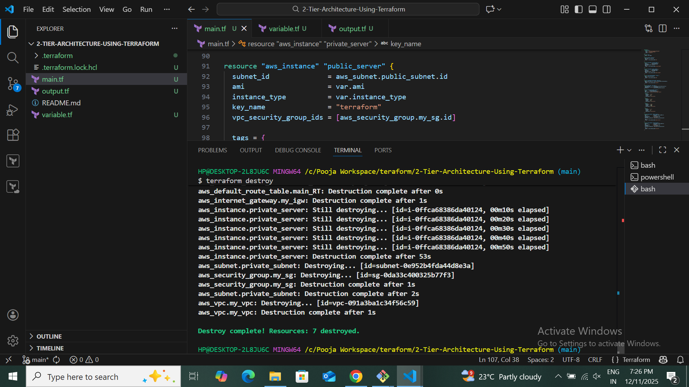
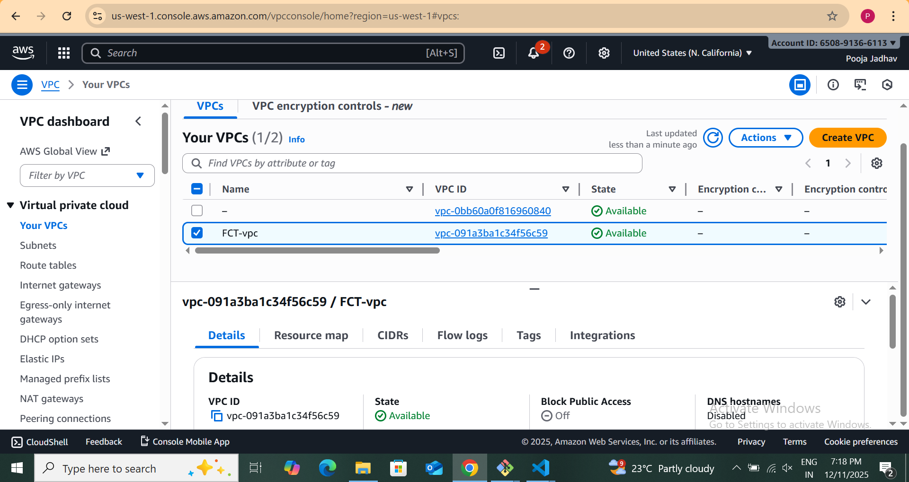

# 2-Tier-Architecture-Using-Terraform

## Overview
This project demonstrates how to deploy a Production-ready 2-Tier Architecture on AWS using Terraform IaC (Infrastructure as Code).
The architecture includes a Network Tier (VPC layer) and Application Tier (EC2 layer) with secure communication between them.

## Architecture

## Project Structure
      2-tier-terraform-project
      │
      ├── main.tf
      ├── variables.tf
      ├── outputs.tf
      ├── provider.tf
      ├── terraform.tfvars (optional)
      │
      └── images/

 ## Project Description

This Terraform project provisions a complete secure 2-Tier AWS architecture, consisting of:

### Tier 1: Networking Layer

- Custom VPC

- Public Subnet (for Web Server)

- Private Subnet (for App / DB Server)

- Internet Gateway

- Route Table for Public Subnet

- Route Table Association

- Security Groups

- (Optional future: NAT Gateway, Load Balancer)     

### Tier 2: Application / Compute Layer

- EC2 instance in Public Subnet (Web Tier)

- EC2 instance in Private Subnet (App/Backend Tier)

- Secure traffic between tiers using SG rules

- Web tier publicly accessible, app tier private/isolated

#### This architecture can be extended as a baseline for production systems like:

 ✔ Web App + Database

✔ App Server + Cache Server

✔ API + Backend 

## What This Terraform Code Does
### 1. Creates VPC

- Custom CIDR block

- Logical isolation for your AWS resources

###  2. Creates Public Subnet

- For web server

- Internet accessible

### 3. Creates Private Subnet

- For backend / DB server

- No direct Internet access

### 4. Internet Gateway

- Allows public subnet to communicate over the Internet

### 5. Route Table

- Public subnet → Internet

- Private subnet → Internal traffic only

### 6. Security Groups

- Control inbound/outbound traffic

- Web SG → HTTP (80), SSH (22)

- App SG → allow traffic only from Web SG

### 7. EC2 Instances

- One instance in Public Subnet

- One instance in Private Subnet

## How to Deploy
### Step 1: Initialize Terraform
           
            terraform init

### Step 2: Terraform Plan
             terraform plan

  

 ### Step 3: Terraform Apply
              terraform apply
                         

 ### Step 4: Terraform Destroy
            terraform destroy
            

 ## Important Terraform Variables
 | Variable Name       | Description             |
| ------------------- | ----------------------- |
| vpc_cidr            | CIDR block of the VPC   |
| public_subnet_cidr  | CIDR for public subnet  |
| private_subnet_cidr | CIDR for private subnet |
| instance_type       | EC2 instance type       |
| ami                 | AMI ID of EC2 instance  |
| region              | AWS region to deploy    |

These values can be kept in terraform.tfvars.

## Outputs :

After deployment Terraform will show:

## 1. Instances

## 2. VPC

## 3.Subnet

## 4. Route Table

## 5. Security Group

## 6. Internet Gateway

## 7. S3 Bucket

## Real-World Use Case

This 2-tier architecture is used by companies for:

- Hosting web servers in public subnet

- Running backend/API/DB in private subnet

- Secure isolation between front-end and backend

- Small to mid-size production workloads

- Testing and development environments.

## Future Enhancements

You can expand this architecture easily by adding:

 -  NAT Gateway

- Application Load Balancer

-  Auto Scaling Group

-  RDS Database

-  Monitoring with CloudWatch

 - Jenkins CI/CD for automation

 ## Conclusion

This project demonstrates a fully automated and production-like 2-Tier AWS architecture deployed using Terraform.

It shows how to manage networking, compute, routing, and security using Infrastructure as Code.

This setup is scalable, secure, and forms the foundation of most cloud-native architectures.

## Author
Pooja Jadhav